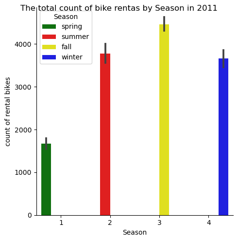
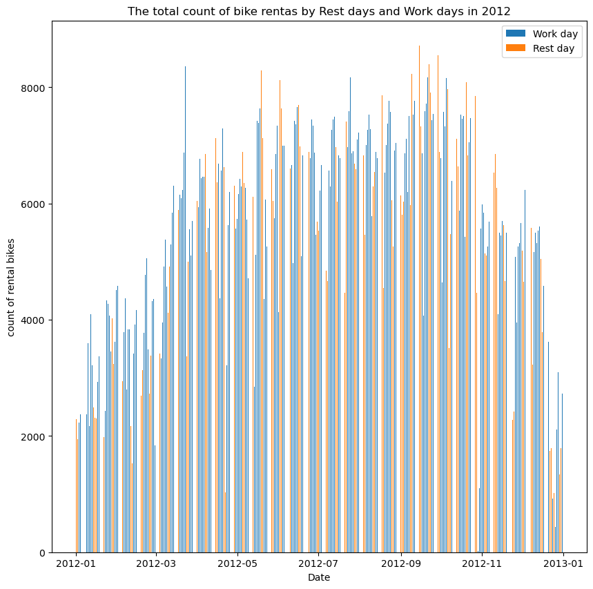

# Final report of group 45C
## Introduction: 

The reason why I chose this dataset is first of all because we often need to use public transportation like shared bicycles in our daily life, and the data obtained from the research can be applied to real life. Secondly, because, as I mentioned before, the analysis and collation of total public transportation data can allow people to make certain judgments on current and future trends, and it can be of great help in urban safety and information collation. Although at my current level, I cannot implement complex methods such as modeling to predict the future, but I can make simple judgments based on the currently known data. I am very interested in this dataset and my topic, and if I have the opportunity, if I learn more skills about data analysis in my future studies, I may go back and continue to work on this assignment.

## Exploratory Data Analysis: 
If youb want, you can check all the analysis notebook including the code and the data [here](http://localhost:8888/lab/tree/analysis/analysis2.ipynb)

First of all, it can be seen from the various images of the plot that the overall trend of the number of rental bicycles in 2011 and 2012 is very similar. The number will increase from spring, peak season in summer and autumn, and then gradually decrease in autumn and winter. However, after data integration, it was found that the real peaks all appeared in autumn. The overall number of users in 2012 was much higher than in 2011.

From the heat map from 2011 to 2012, it can be seen that the darker the color, the greater the number. In these two years, the color started to become darker in February or March, and the number of users increased, usually lasting until ten The month will start to fade, that is, the number of users will decrease. This is a rough overview of the monthly change in the number of users over the past two years, which can help people get a rough idea. This is the first visualization image.

It is worth noting that in September 2011, the number of users began to decrease, but 2011 did not start to decrease until the end of October. We will continue to demonstrate this point in the following images.

Next is the heat map distribution of the monthly weekdays in 2011 and 2012. The quantity is still distinguished according to the depth of the color.

It is not difficult to see from this image that until October 2012, there were still several days, and the number reached more than 7,000. In contrast, the dark color block in 2011 stopped in September, and the dark part of September 2011 was not as much as September 2012. So I think the 2012 peak season lasted longer than 2011. This can also be observed if you look at the images of the monthly ridgeline for the past two years, 2012 until November, when the number of rental bikes gradually returned to below 6,000. My guess is that the temperature in 2012 was higher than in 2011, and the temperature was still relatively warm until October, so the number of rental bicycles was more than in 2011.

## My research question is, the relationship between the number of users(cnt) and the date (holidays, weekends, weekdays, seasons, and these are of course related to year month day).
The study result of the analysis can be summarized as some points.
First of all, it can be seen from the various images of my plot that the overall number of users in 2012 is much more than that in 2011. From the seasonal distribution chart of the number of users in 2012, it can be seen that the data in 2011 was only about 1700, 3800, 4400, and 3700, and in 2012 it reached 3500, 6200, 6700, and 6000, which almost doubled. The peak in 2012 still occurred in autumn. The overall trend in the number of rental bikes in 2011 and 2012 is very similar. From almost every image, it can be seen that the number of rented shared bicycles will increase from spring, peak season in summer and autumn, and then gradually decrease in winter. However, through the data integration of seasonal distribution images, it is found that the real peaks appear in autumn and then decline.

Secondly, according to the histogram of workingday and restday (restday includes holiday and weekend), the number of shared bicycles will be very high every day during the peak season. On a restday in July 2011, the number of users soared to an unprecedented height. It was the only holiday in July. In the heat map of weekday in 2012, compared with 2011, the peak period in 2011 appeared more on Saturdays and Sundays, and once on Tuesdays. In 2012, weekday peaked many times even on working day, such as Wednesday in August and September, Friday in September, etc. So in peak seasons like summer and autumn, shared bicycles are a very important means of transportation , whether it is a weekday or a holiday.

## Summary/Conclusion:
In summary, the number of users using shared bicycles in 2012 was almost double that of 2011. The peak periods of these two years have occurred in summer and autumn, and autumn is the peak. In the peak season, whether it is a holiday or a weekday, people rely heavily on shared bicycles, so the peaks on weekdays are relatively random.

This project is the first project I have completed independently, and it is also the first time I have directly updated and promoted my project with what I have learned in real time. To be honest, it made me grow a lot, because I have no one to rely on, and no one to supervise me, I need to rely on my inner drive to complete. This is definitely not the last time, but since then I will not be afraid to complete the project independently, because I think I have enough strength to do well